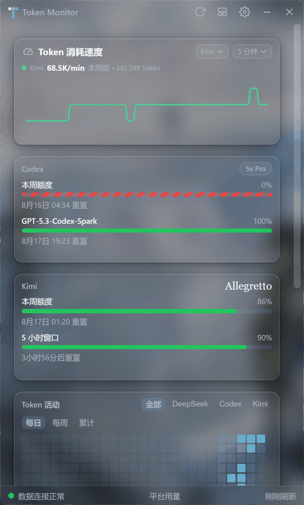
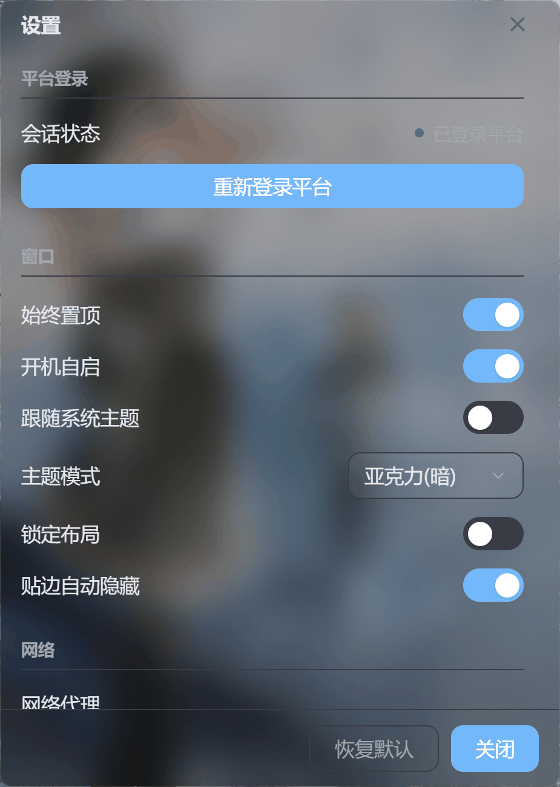

# AgentFlow Monitor

**中文** | [English](README.en.md)

多平台 AI 用量监控桌面悬浮窗 —— 在同一个窗口里实时追踪 **DeepSeek**、**Codex(OpenAI)**、**Kimi**、**OpenCode** 四家平台的额度、余额与 Token 消耗。



## 功能

### 平台额度看板

- **Codex**:本周额度与模型级窗口(如 GPT-5.3-Codex-Spark),右上角标注套餐(如 `5x Pro`),带重置倒计时。
- **Kimi**:本周额度与 5 小时窗口,标注套餐名称(如 Allegretto),带重置倒计时。
- **OpenCode**:滚动 / 每周 / 每月额度窗口,复用本机 OpenCode CLI 凭证,带重置倒计时。
- **DeepSeek**:余额、今日消耗、缓存命中率三张统计卡片。

### 图表

- **费用增长趋势**:每日费用柱状 + 累计曲线。
- **Token 消耗趋势**:输出 / 缓存命中 / 缓存未命中堆叠。
- **DeepSeek 每日 Token 消耗**:按模型(pro / flash 等)堆叠的每日柱状图。
- **每日 Token 消耗**:DeepSeek、Codex、Kimi、OpenCode 四平台同图堆叠,与热力图同源。
- **Token 活动热力图**:GitHub 风格年度热力图,可按平台 / 每日 / 每周 / 累计切换,悬浮显示当日各平台明细与总消耗,随窗口宽度自适应可见月份。

#### Token 消耗速度

- 在设置 → 组件中开启“Token 消耗速度（会增加内存占用）”。
- 支持展示全部、DeepSeek、Codex、Kimi、OpenCode，以及 10 秒到 5 小时的八种滚动窗口。
- 曲线显示标准化后的 Token/分钟，悬停可查看本周期增量。
- 模块只在开启后开始计数；关闭会停止额外监听并清除最近 6 小时速度历史。

### 窗口与交互

- **Windows 11 亚克力磨砂 + 圆角**:DWM 合成层绘制,缩放时圆角与窗口永远同步;原生边缘缩放,无延迟、无黑边;失焦不褪色。
- **主题模式**:跟随系统 / 日间 / 夜间 / 亚克力(亮)/ 亚克力(暗),主窗口与设置窗口联动切换。
- **贴边自动隐藏**:把窗口拖到屏幕左、右或上边缘自动停靠,收起只留一条触发条,悬停阻尼动画滑出;托盘唤醒或打开设置时自动完整展开。
- **自由布局**:点标题栏"编辑布局"图标后,每个卡片可拖拽换位、拉伸改尺寸;设置中可一键锁定。
- **组件显隐**:设置面板里按卡片开关显示内容。
- **网络代理**:系统代理(自动识别当前代理端口预填)/ 直连 / 自定义代理。
- **系统托盘**:显示 / 隐藏窗口、重新登录平台、打开设置、退出。
- 始终置顶、开机自启。



## 数据来源

| 平台 | 方式 |
| --- | --- |
| DeepSeek | API Key 查询余额;内置代理会话(首次需登录 DeepSeek 平台)获取用量明细 |
| Codex | 只读复用本机 Codex CLI 凭证(由 CLI 自己保活刷新,无需重复登录) |
| Kimi | 只读复用本机 Kimi CLI 凭证(由 CLI 自己保活刷新,无需重复登录) |
| OpenCode | 只读复用本机 OpenCode CLI 凭证;额度走 OpenCode Go usage API,本地用量读 opencode.db |

所有数据仅在本地处理,不会上传到任何第三方服务器。

## 快速开始

环境要求:Node.js ≥ 18(推荐 20+)、npm ≥ 9。Windows 11 可获得完整的亚克力与圆角体验(Windows 10 退化为直角、无磨砂)。

```bash
npm ci
npm --prefix renderer ci
npm start                # 自动构建 renderer 并启动 Electron
```

`npm start` 会先执行 renderer 的生产构建。构建失败时 Electron 不会启动；如果绕过 npm 脚本直接启动 Electron，主进程也会在创建窗口前检查构建产物并明确退出。

首次启动会弹出登录窗口,输入 DeepSeek API Key(`sk-` 开头,在 [DeepSeek 开发者平台](https://platform.deepseek.com/api_keys) 创建),随后按提示完成平台登录即可。

### 常用命令

```bash
npm test                 # 运行全部测试(node --test)
npm run build:renderer   # 仅构建渲染层(React + Vite)
npm run dev:renderer     # 渲染层 Vite 开发服务器
npm run build:win        # 打包 Windows 安装包(electron-builder)
npm run build:mac        # 打包 macOS
```

## 技术栈

- **Electron 40** — 主进程、窗口与托盘
- **React 18 + Vite** — 仪表盘渲染层
- **ECharts 5** — 趋势 / 堆叠图表
- **gridstack 12** — 卡片自由布局
- **electron-store 8** — 设置与窗口状态持久化

## 项目结构

```
src/main/        Electron 主进程(窗口、托盘、IPC、数据调度)
src/preload/     预加载脚本(IPC 白名单)
src/renderer/    设置窗口、登录窗口等独立页面
renderer/        仪表盘 React 应用(Vite 构建到 renderer/dist)
test/            node --test 测试套件
docs/screenshots README 截图
```

## License

MIT
